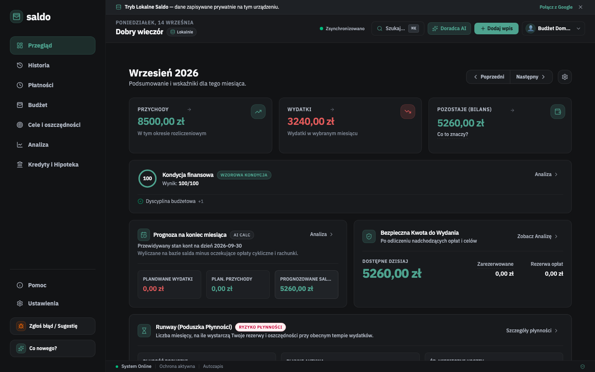

# Saldo

Lokalna, prywatna aplikacja do zarządzania finansami osobistymi i domowymi — budżet, płatności cykliczne, cele oszczędnościowe, portfel długów (w tym Kredyt Hipoteczny Pro) i doradca AI działający lokalnie (Ollama). Startuje w 100% offline, bez wymuszania logowania Google/e-mail — synchronizacja w chmurze jest w pełni opcjonalna. Dostępna jako aplikacja webowa (PWA) oraz natywna aplikacja desktopowa na macOS i Windows.



## Funkcje

- **Local-First od pierwszego uruchomienia** — kreator onboardingu tworzy lokalny profil (nazwa, wektorowy awatar, waluta, opcjonalny PIN) bez konta Google czy e-maila; logowanie w chmurze jest dostępne później, wyłącznie w Ustawieniach, jako opcja.
- **Pulpit** — bieżący bilans, trendy wydatków, skrócony przegląd nadchodzących płatności i celów.
- **Transakcje i budżet** — kategorie z limitami, import wyciągów (CSV/PDF, w tym mBank), wykrywanie duplikatów.
- **Płatności cykliczne** — przypomnienia o terminach, natywne powiadomienia systemowe.
- **Cele oszczędnościowe** — śledzenie postępu, scenariusze dojścia do celu.
- **Portfel długów** — strategie spłaty (lawina/kula śnieżna), Kredyt Hipoteczny Pro (test warunków skrajnych KNF, wakacje kredytowe, raty malejące, monitoring LTV).
- **Doradca AI (lokalny, Ollama)** — czat uziemiony w deterministycznym silniku finansowym aplikacji, może zaproponować i zapisać konkretny plan działania.
- **Synchronizacja** — kopia zapasowa i synchronizacja przez Google Drive, eksport/import JSON.
- **Bezpieczeństwo** — szyfrowanie profilu kluczem z PIN-u, prawdziwe odblokowanie Touch ID / Windows Hello (Keychain/DPAPI) na desktopie — dostępne od razu w kreatorze onboardingu i w ekranie wyboru profilu, automatyczna blokada po zablokowaniu ekranu.

### Aplikacja desktopowa (Electron)

- Auto-aktualizacja w tle (`electron-updater`) — z ręcznym sprawdzaniem zarówno z poziomu menu, jak i prostym przyciskiem w widoku "Historia Zmian" w aplikacji.
- Podpisywanie kodu i notaryzacja (macOS) / code-signing (Windows) skonfigurowane w CI.
- Ikona w tray z szybkim dodawaniem wydatku, dock badge, natywne powiadomienia, autostart z systemem.
- Zapamiętywanie rozmiaru/pozycji okna, natywne okna dialogowe zapisu/odczytu kopii zapasowej.
- Natywne menu kontekstowe (Wytnij/Kopiuj/Wklej, podpowiedzi pisowni) na każdym polu tekstowym, branded panel "O Programie".
- Przeciąganie wyciągu (CSV/PDF) z Findera/Eksploratora bezpośrednio na okno lub ikonę Docka/paska zadań — automatycznie otwiera import, nawet gdy aplikacja jeszcze go nie pokazuje.

Pełna lista i status wdrożenia: [TODO_DESKTOP.md](TODO_DESKTOP.md).

## Stos technologiczny

- **Frontend**: React 19, TypeScript, Vite, Tailwind CSS, Framer Motion, Recharts
- **Backend**: Express 5, uruchamiany zarówno jako serwer webowy, jak i embedded w aplikacji Electron
- **Dane**: Firebase (Auth, Firestore) + lokalny cache offline
- **Desktop**: Electron, electron-builder, electron-updater
- **Testy**: Vitest (testy jednostkowe/integracyjne), Playwright (E2E)

## Szybki start

### Wymagania
- Node.js ≥ 22 (rekomendowane: 22 LTS)
- npm ≥ 10

```bash
# opcjonalnie przez nvm
nvm install
nvm use

npm ci
cp .env.example .env   # uzupełnij własnymi kluczami/konfiguracją
```

### Uruchomienie w trybie deweloperskim

```bash
npm run dev              # aplikacja webowa (Vite + Express) pod http://localhost
npm run dev:desktop      # to samo, opakowane w okno Electron
```

## Skrypty npm

| Skrypt | Opis |
| --- | --- |
| `npm run dev` | Serwer deweloperski (web) |
| `npm run build` | Build produkcyjny (frontend + embedded server) |
| `npm run start` | Uruchomienie zbudowanej wersji produkcyjnej |
| `npm run lint` | Sprawdzenie typów (`tsc --noEmit`) |
| `npm run test` | Testy jednostkowe/integracyjne (Vitest) |
| `npm run test:e2e` | Testy E2E (Playwright) |
| `npm run dev:desktop` | Aplikacja desktopowa w trybie deweloperskim |
| `npm run build:desktop` | Pakowanie aplikacji desktopowej na bieżącą platformę |
| `npm run build:desktop:all` | Pakowanie na macOS i Windows |
| `npm run release:desktop` | Build + publikacja wydania (GitHub Releases) |

## Wydanie aplikacji desktopowej

Publikacja wydania odbywa się automatycznie przez [.github/workflows/release-desktop.yml](.github/workflows/release-desktop.yml) po wypchnięciu taga `v*` (np. `v1.4.0`) — workflow buduje, podpisuje, notaryzuje (macOS) i publikuje artefakty na GitHub Releases. Wymaga skonfigurowanych sekretów repozytorium: `APPLE_ID`, `APPLE_APP_SPECIFIC_PASSWORD`, `APPLE_TEAM_ID`, `CSC_LINK`, `CSC_KEY_PASSWORD`, `WIN_CSC_LINK`, `WIN_CSC_KEY_PASSWORD`.

## Dokumentacja

- [Design.md](Design.md) — system projektowy i decyzje UI
- [SECURITY_AUTH_PRIVACY.md](SECURITY_AUTH_PRIVACY.md) — model bezpieczeństwa, autoryzacja, prywatność
- [PERFORMANCE.md](PERFORMANCE.md) — uwagi o wydajności
- [RELEASE_QA_CHECKLIST.md](RELEASE_QA_CHECKLIST.md) — lista kontrolna przed wydaniem
- [CHANGELOG.md](CHANGELOG.md) — historia zmian
- [TODO_DESKTOP.md](TODO_DESKTOP.md) — status funkcji specyficznych dla desktopu

## Status

Projekt prywatny, rozwijany na własny użytek.
