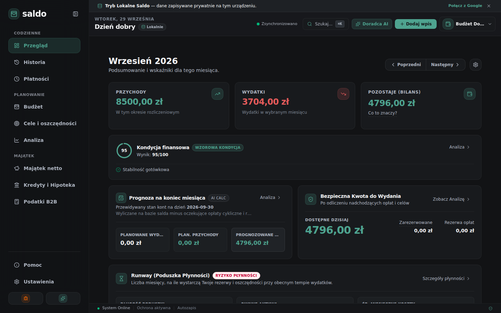

<div align="center">

# Saldo

**Prywatne finanse osobiste i domowe — lokalnie, bez konta, z doradcą AI pod Twoją kontrolą.**

[](https://github.com/Silvanion/saldo/releases/latest)
[](https://github.com/Silvanion/saldo/actions/workflows/ci.yml)


[Pobierz](#pobierz) · [Dlaczego Saldo](#dlaczego-saldo) · [Funkcje](#funkcje) · [Import z banków](#import-z-banków) · [Dla deweloperów](#dla-deweloperów)

<br>



</div>

<br>

Saldo to aplikacja do budżetu, płatności cyklicznych, celów oszczędnościowych i długów (w tym Kredyt Hipoteczny Pro). Startuje w 100% offline i nie wymusza logowania Google ani e-maila — synchronizacja w chmurze jest w pełni opcjonalna. Dostępna jako aplikacja webowa (PWA) oraz natywna aplikacja desktopowa na macOS i Windows.

## Dlaczego Saldo

| | |
| --- | --- |
| **Local-first** | Kreator tworzy lokalny profil (nazwa, awatar, waluta, opcjonalny PIN) bez konta. Dane zostają na Twoim urządzeniu; chmura jest dostępna później, wyłącznie w Ustawieniach. |
| **AI, które wybierasz Ty** | Lokalny model przez Ollama (nic nie opuszcza komputera) albo własny klucz Gemini lub Claude. Klucz jest przechowywany w bezpiecznym magazynie systemu, a aplikacja pokazuje, co dokładnie trafia do dostawcy. |
| **Polskie banki** | Import wyciągów CSV i PDF z dedykowanymi parserami Alior Banku i Zen oraz ostrzeżeniami o przelewach własnych i operacjach na koncie kredytowym. |
| **Bezpieczeństwo** | Szyfrowanie profilu kluczem z PIN-u, odblokowanie Touch ID / Windows Hello, automatyczna blokada po zablokowaniu ekranu. |

## Pobierz

Najnowsza wersja: **[GitHub Releases → Latest](https://github.com/Silvanion/saldo/releases/latest)**

| System | Plik |
| --- | --- |
| macOS — Apple Silicon (M1–M5) | `Saldo-<wersja>-arm64.dmg` |
| macOS — Intel | `Saldo-<wersja>.dmg` |
| Windows — instalator | `Saldo-Setup-<wersja>.exe` |
| Windows — wersja przenośna | `Saldo-<wersja>-portable.exe` |

<details>
<summary><b>Pierwsze uruchomienie i aktualizacje</b></summary>

<br>

**macOS.** Wydania nie są jeszcze notaryzowane przez Apple (podpis ad-hoc), dlatego przy pierwszym otwarciu system pokaże ostrzeżenie. Otwórz **Ustawienia systemowe → Prywatność i ochrona**, w sekcji *Ochrona* kliknij **„Otwórz mimo to”** przy Saldo — wystarczy raz. Z tego samego powodu aktualizacje na macOS instaluje się ręcznie: aplikacja informuje o nowej wersji i otwiera stronę wydania.

**Windows.** Wydania nie są jeszcze podpisane cyfrowo, więc SmartScreen może pokazać ostrzeżenie przy pierwszym uruchomieniu instalatora. Aktualizacje instalują się automatycznie po potwierdzeniu w aplikacji.

</details>

## Funkcje

Menu boczne grupuje funkcje według sposobu użycia.

**Codzienne**
- **Przegląd** — bieżący bilans, trendy wydatków, kondycja finansowa, prognoza na koniec miesiąca, bezpieczna kwota do wydania i skrócony przegląd płatności oraz celów.
- **Historia** — transakcje z kategoriami, tagami i wykrywaniem duplikatów, import wyciągów CSV/PDF.
- **Płatności** — cykliczne rachunki, przypomnienia o terminach, natywne powiadomienia systemowe.

**Planowanie**
- **Budżet** — kategorie z limitami.
- **Cele i oszczędności** — śledzenie postępu, scenariusze dojścia do celu.
- **Analiza** — wykresy i podsumowania wydatków.

**Majątek**
- **Majątek netto** — aktywa i zobowiązania w jednym widoku.
- **Kredyty i Hipoteka** — strategie spłaty (lawina / kula śnieżna), Kredyt Hipoteczny Pro (test warunków skrajnych KNF, wakacje kredytowe, raty malejące, monitoring LTV).
- **Podatki B2B** — kalkulator przyjmujący dane z Analizy.

**Doradca AI** — czat uziemiony w deterministycznym silniku finansowym aplikacji; może zaproponować i zapisać konkretny plan działania. Działa z lokalnym modelem (Ollama) albo z własnym kluczem Gemini/Claude. Przy niedostępności dostawcy chmurowego aplikacja ponawia zapytanie i pokazuje czytelny komunikat.

**Dane i kopie zapasowe** — kopia zapasowa i synchronizacja przez Google Drive (opcjonalnie), eksport i import JSON.

## Import z banków

| Bank | Format | Status |
| --- | --- | --- |
| Alior Bank | CSV „Historia operacji”, PDF „Historia transakcji” | Dedykowany parser, sprawdzony na prawdziwym eksporcie; CSV i PDF dają te same sumy |
| Zen | CSV „Account Statement”, PDF | Dedykowany parser, sprawdzony na prawdziwym eksporcie; saldo z PDF służy do kontroli ciągłości |
| Pozostałe banki (m.in. mBank) | CSV, PDF | Ogólne mapowanie kolumn z podglądem przed importem |

Import zawsze przechodzi przez podgląd i wymaga Twojego potwierdzenia. Aplikacja czyta kodowanie plików (UTF-8 i Windows-1250) i oznacza wiersze, które mogą dublować inne pozycje — przelewy między własnymi rachunkami i operacje na koncie limitu lub kredytu. Kategorie zaproponowane przez lokalne AI są wyraźnie oznaczone.

## Aplikacja desktopowa

- **Folder z wyciągami** (Ustawienia → Kopia i raporty): nowy plik CSV/PDF wywołuje powiadomienie systemowe, a import wymaga potwierdzenia w podglądzie. Można też przeciągnąć wyciąg z Findera/Eksploratora na okno lub ikonę Docka/paska zadań.
- **Aktualizacje** przez `electron-updater`: powiadomienie w aplikacji, pobranie dopiero po potwierdzeniu, ręczne sprawdzanie z menu i z widoku „Historia Zmian”.
- **Integracja z systemem**: ikona w tray z szybkim dodawaniem wydatku, dock badge, natywne powiadomienia, autostart, zapamiętywanie rozmiaru i pozycji okna, natywne okna dialogowe kopii zapasowej.
- **Odporność na awarie**: automatyczne odświeżenie okna po awarii procesu renderującego i dziennik zdarzeń diagnostycznych.

Pełna lista i status wdrożenia: [TODO_DESKTOP.md](TODO_DESKTOP.md).

## Dla deweloperów

**Stos:** React 19, TypeScript, Vite, Tailwind CSS, Framer Motion, Recharts · Express 5 (serwer webowy i wbudowany w Electron) · Firebase (Auth, Firestore) + lokalny cache offline · Electron, electron-builder, electron-updater · Vitest i Playwright.

### Szybki start

Wymagania: Node.js ≥ 22 (rekomendowane 22 LTS), npm ≥ 10.

```bash
# opcjonalnie przez nvm
nvm install
nvm use

npm ci
cp .env.example .env   # uzupełnij własnymi kluczami/konfiguracją

npm run dev            # aplikacja webowa (Vite + Express)
npm run dev:desktop    # to samo, opakowane w okno Electron
```

### Skrypty npm

| Skrypt | Opis |
| --- | --- |
| `npm run dev` | Serwer deweloperski (web) |
| `npm run build` | Build produkcyjny (frontend + embedded server) |
| `npm run start` | Uruchomienie zbudowanej wersji produkcyjnej |
| `npm run lint` | Sprawdzenie typów (`tsc --noEmit`) |
| `npm run test` | Testy jednostkowe/integracyjne (Vitest) |
| `npm run test:e2e` | Testy E2E (Playwright) |
| `npm run dev:desktop` | Aplikacja desktopowa w trybie deweloperskim |
| `npm run build:desktop` | Pakowanie aplikacji desktopowej na bieżącą platformę |
| `npm run build:desktop:all` | Pakowanie na macOS i Windows |
| `npm run release:desktop` | Build + publikacja wydania (GitHub Releases) |

<details>
<summary><b>Architektura desktopu</b></summary>

<br>

Aplikacja Electron uruchamia wbudowany serwer Express (`dist/server.cjs`) wyłącznie na `127.0.0.1` i ładuje interfejs z `http://localhost:<port>`. Dane użytkownika trzymane są w IndexedDB/localStorage, które są izolowane per origin — dlatego port jest wybierany raz i zapisywany w `userData/server-port.json` (macOS: `~/Library/Application Support/saldo-app/`), aby origin, a więc i dane, był stały między uruchomieniami. Logi: `~/Library/Logs/saldo-app/main.log` (macOS), `%APPDATA%\saldo-app\logs` (Windows).

</details>

<details>
<summary><b>Wydanie aplikacji desktopowej</b></summary>

<br>

1. Podbij wersję (`npm version <x.y.z> --no-git-tag-version`) i dodaj wpis w [CHANGELOG.md](CHANGELOG.md) oraz `src/content/changelogData.tsx` (widok „Co nowego” w aplikacji). Wersję widoczną w aplikacji wyznacza `package.json`.
2. Po scaleniu do `main` wypchnij tag `v*` (np. `git tag -a v1.6.2 -m "Saldo v1.6.2" && git push origin v1.6.2`).
3. [.github/workflows/release-desktop.yml](.github/workflows/release-desktop.yml) buduje macOS (arm64 + x64) i Windows, sprawdza zgodność `latest*.yml` z zbudowanymi plikami, tworzy **szkic** wydania i dołącza artefakty.
4. Uzupełnij opis i opublikuj szkic — dopiero opublikowane wydanie widzą aplikacje sprawdzające aktualizacje.

**Podpisywanie.** Z sekretami `CSC_LINK`, `CSC_KEY_PASSWORD`, `APPLE_ID`, `APPLE_APP_SPECIFIC_PASSWORD`, `APPLE_TEAM_ID` build macOS jest podpisywany Developer ID i notaryzowany (pełne auto-aktualizacje, brak ostrzeżeń Gatekeepera); bez nich — podpis ad-hoc. Podpisywanie wydań Windows jest na razie wstrzymane.

</details>

## Dokumentacja

- [Design.md](Design.md) — system projektowy i decyzje UI
- [SECURITY_AUTH_PRIVACY.md](SECURITY_AUTH_PRIVACY.md) — model bezpieczeństwa, autoryzacja, prywatność
- [PERFORMANCE.md](PERFORMANCE.md) — uwagi o wydajności
- [RELEASE_QA_CHECKLIST.md](RELEASE_QA_CHECKLIST.md) — lista kontrolna przed wydaniem
- [CHANGELOG.md](CHANGELOG.md) — historia zmian
- [TODO_DESKTOP.md](TODO_DESKTOP.md) — status funkcji specyficznych dla desktopu

## Status

Projekt rozwijany prywatnie, kod publicznie dostępny. Zgłoszenia błędów: [Issues](https://github.com/Silvanion/saldo/issues) lub formularz „Zgłoś błąd” w aplikacji.
