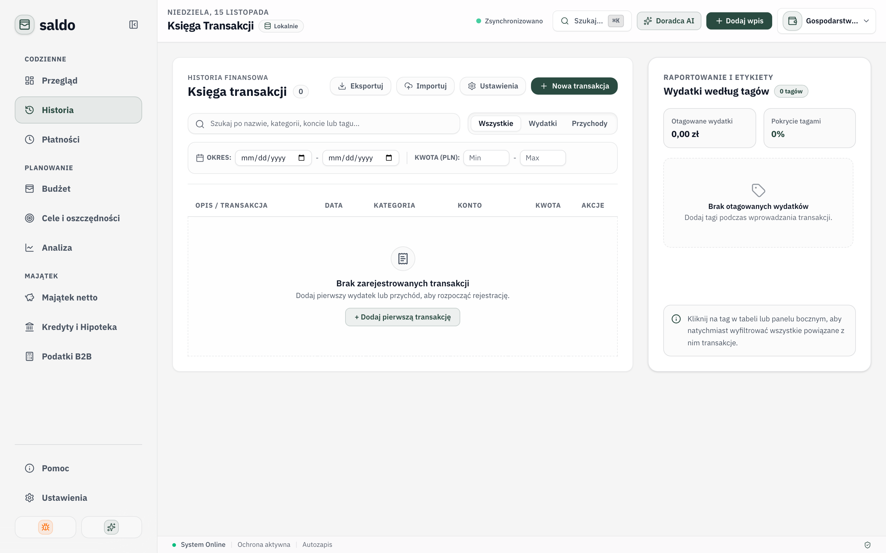
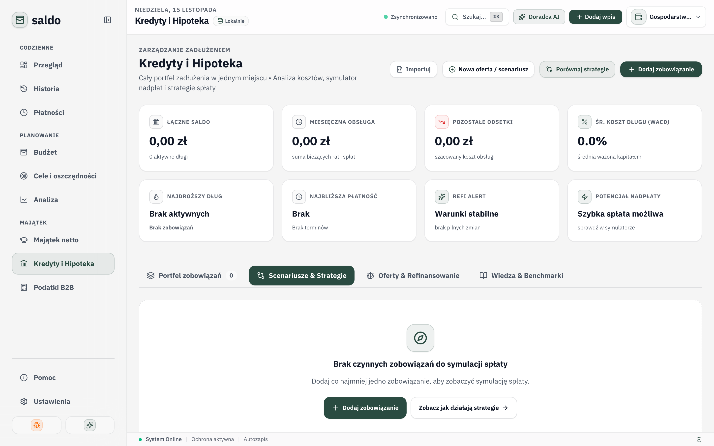
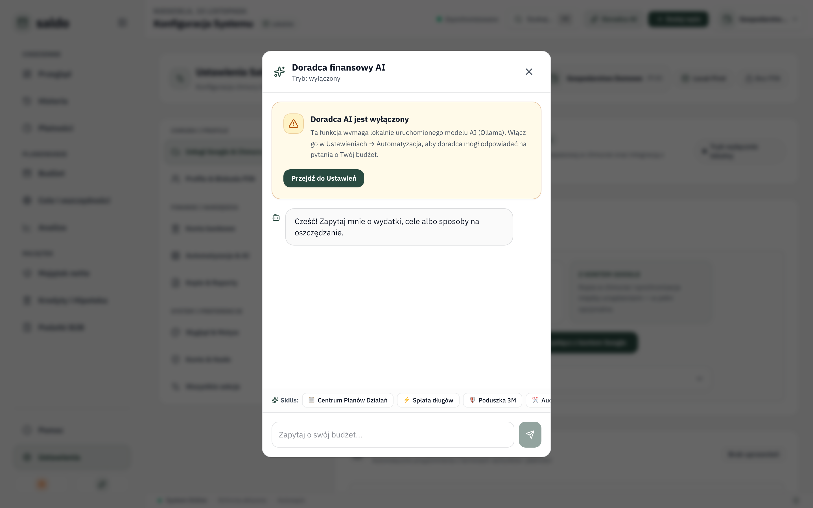
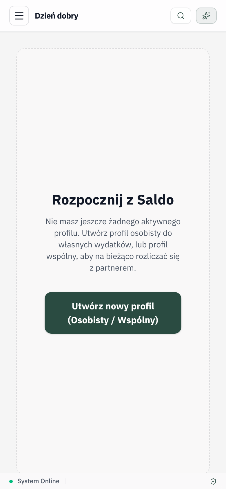
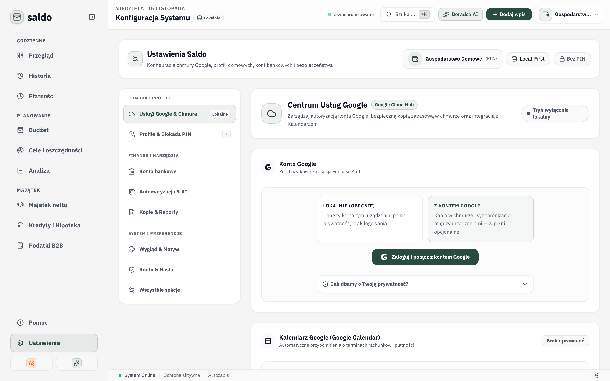

<div align="center">


# Saldo

**Prywatne finanse osobiste i domowe — 100% offline & local-first. Z aplikacją mobilną (Expo), silnikiem domenowym `@saldo/core` i prywatnym AI (Ollama) pod Twoją kontrolą.**

[](https://github.com/Silvanion/saldo/releases/latest)
[](LICENSE)
[](https://github.com/Silvanion/saldo/releases/latest)
[](SECURITY_AUTH_PRIVACY.md)
[](e2e/axe.spec.ts)

<br>

[Pobierz aplikację](#-pobierz-i-zainstaluj) · [Nowości w v1.6.7](#-nowości-w-wersji-167) · [Kluczowe moduły](#-przegląd-modułów-aplikacji) · [Import z banków](#-import-wyciągów-bankowych) · [Architektura](#-architektura-i-deweloperzy) · [Bezpieczeństwo](#-bezpieczeństwo-i-prywatność)

<br>


</div>

---

## 💡 Dlaczego Saldo?

Większość aplikacji finansowych wymaga połączenia z bankiem przez zewnętrznych agregatorów, zakłada obowiązkowe konta w chmurze i przetwarza poufne dane transakcyjne na obcych serwerach. **Saldo powstało w opozycji do tego modelu.**

| Filar | Jak to działa w Saldo? |
| :--- | :--- |
| 🛡️ **100% Local-First & Zero-Cloud** | Twoje finanse należą wyłącznie do Ciebie. Zapisywane są lokalnie w szyfrowanej bazie IndexedDB (desktop/web) oraz SQLite WAL (mobile). Aplikacja nie wymaga konta ani internetu do pełnego działania. |
| 📱 **Ekosystem Mobile + Desktop** | Jedno spójne doświadczenie: natywna aplikacja desktopowa (macOS, Windows), PWA oraz nowoczesna aplikacja mobilna (iOS & Android via Expo SDK 52) z natywną biometrią Face ID / Touch ID. |
| 🧠 **Współdzielony silnik domenowy** | Pakiet `@saldo/core` gwarantuje identyczne, deterministyczne wyliczenia hipoteki, podatków B2B 2026 i budżetu 50/30/20 na każdej platformie, bez zależności od środowiska wykonawczego. |
| 🤖 **Prywatne AI na Twoich warunkach** | Doradca finansowy AI działa w 100% lokalnie przez **Ollama** (żaden bajt nie opuszcza urządzenia) lub z Twoim własnym kluczem Gemini / Claude zapisanym w systemowym Keychain / SecureStore. |
| 🔏 **Bezpieczeństwo i Przejrzystość** | Kod w 100% otwarty (AGPL-3.0), automatyczna weryfikacja sum kontrolnych SHA-512 przy aktualizacji przez `electron-updater` i zero telemetrycznych bibliotek śledzących. |
| 🇵🇱 **Polskie banki i Podatki B2B 2026** | Dedykowane parsery Alior Bank, Zen oraz uniwersalny parser CSV z autodetekcją przelewów wewnętrznych. Aktualny kalkulator rezerw podatkowych 2026 (ZUS, składka zdrowotna, ryczałt, liniowy, skala). |

---

## 🚀 Nowości w wersji 1.6.7

- 🛡️ **Kompleksowy Audyt Bezpieczeństwa & Architektury 2026-11:**
  - **SEC-01 / SEC-05:** Blokada sesji PIN chroni przed wyciekiem jawnym tekstem do pamięci i na dysk; natychmiastowe szyfrowanie po wygaśnięciu sesji.
  - **SEC-06:** Bezpieczne przechowywanie kluczy API (desktop: macOS Keychain; web: `sessionStorage` — klucz znika po zamknięciu karty).
  - **UX-01:** Automatyczne, rotacyjne lokalne kopie zapasowe na pulpicie (do 30 wersji historii).
  - **A11Y-01..04:** Pełna zgodność z normą **WCAG 2.1 AA** (kontrast, nawigacja klawiaturą, skany axe-core dla 9 widoków w obu motywach).
  - **LEGAL-01:** Kanoniczna licencja **GNU Affero General Public License v3.0** (`AGPL-3.0-only`).
- 📱 **Monorepo i Saldo Mobile (Expo SDK 52 / React Native 0.76):**
  - Nowa aplikacja mobilna w `packages/mobile` z obsługą iOS, Android i podglądu Web.
  - Szybkie dodawanie wydatków (Quick Add) w 3 sekundy z haptyczną informacją zwrotną.
  - Zabezpieczenie biometryczne (Face ID / Touch ID / BiometricPrompt) oraz szyfrowany PIN w bezpiecznej enklawie (`SecureStore`).
  - Baza danych SQLite w trybie transakcyjnym WAL (`expo-sqlite`).
- 🧩 **Czysty pakiet domenowy (`@saldo/core`):**
  - Wyodrębnienie czystej logiki finansowej do `packages/core` — podatki 2026, algorytmy spłaty zadłużenia (Kula śnieżna, Lawina), MortgagePro LTV oraz parsery bankowe.
- 🇵🇱 **Aktualizacja stawek podatkowych 2026:**
  - Nowe oficjalne parametry ZUS i składki zdrowotnej dla jednoosobowych działalności gospodarczych (JDG).
- ⚡ **Niezrównany rygor testowy:**
  - **155 plików testowych (1435 testów jednostkowych i integracyjnych)** w aplikacji głównej + dedykowane testy domenowe `@saldo/core` i testy biometrii mobilnej (100% PASS).

---

## 📸 Przegląd modułów aplikacji

<table width="100%">
<tr>
<td width="50%" valign="top">
  <h3>📊 Pulpit i Budżet 50/30/20</h3>
  <p>Kompleksowy przegląd kondycji finansowej, prognoza do końca miesiąca, bezpieczna kwota do wydania (Safe-to-Spend) oraz dynamiczny podział budżetu wg zasady 50/30/20 (Potrzeby / Zachcianki / Oszczędności).</p>
  
</td>
<td width="50%" valign="top">
  <h3>💳 Historia Transakcji & Szybkie Dodawanie</h3>
  <p>Błyskawiczne dodawanie wydatków za pomocą skrótów klawiszowych lub palety poleceń (<code>Cmd+K</code>). Normalizacja polskich znaków diakrytycznych, autokategoryzacja oraz filtry zaawansowane.</p>
  
</td>
</tr>
<tr>
<td width="50%" valign="top">
  <h3>🏠 Kredyty i Hipoteka Pro</h3>
  <p>Symulator nadpłat, test warunków skrajnych KNF (+100 do +400 pb.), harmonogramy rat malejących i równych, symulacje wakacji kredytowych oraz bieżący monitoring wskaźnika LTV.</p>
  
</td>
<td width="50%" valign="top">
  <h3>⚡ Strategie Spłaty Zobowiązań</h3>
  <p>Wizualne porównanie strategii Kuli Śnieżnej (najmniejszy dług najpierw) oraz Lawiny (najwyższy procent najpierw). Oszczędność na odsetkach i symulacja przyspieszenia wolności finansowej.</p>
  
</td>
</tr>
<tr>
<td width="50%" valign="top">
  <h3>🤖 Doradca Finansowy AI</h3>
  <p>Prywatny doradca AI oparty o rzeczywiste dane z Twojego budżetu. Wsparcie dla modeli w 100% lokalnych (Ollama) oraz chmurowych (Gemini / Claude). Pomaga zoptymalizować koszty bez wysyłania wrażliwych danych.</p>
  
</td>
<td width="50%" valign="top">
  <h3>📈 Analizy, Trendy i Majątek Netto</h3>
  <p>Struktura wydatków, trendy miesięczne i roczne, weryfikator płynności oraz monitorowanie majątku netto (aktywa płynne, nieruchomości, inwestycje vs. zobowiązania).</p>
  
</td>
</tr>
<tr>
<td width="50%" valign="top">
  <h3>📱 Saldo Mobile (iOS / Android)</h3>
  <p>Kieszonkowe centrum finansowe: błyskawiczne wprowadzanie paragonów z haptyką, wgląd w limity 50/30/20, podgląd rezerwy podatkowej B2B i zabezpieczenie Face ID / Touch ID.</p>
  
</td>
<td width="50%" valign="top">
  <h3>🔒 Centrum Bezpieczeństwa & Kopie Zapasowe</h3>
  <p>Wygodne zarządzanie profilami, ochrona kodem PIN, blokada sesji bezczynności, automatyczne lokalne kopie zapasowe na dysku oraz pełny eksport/import bazy danych.</p>
  
</td>
</tr>
</table>

---

## 🏦 Import wyciągów bankowych

Saldo posiada wbudowany silnik inteligentnego przetwarzania wyciągów bankowych z automatyczną deduplikacją w czasie $O(n)$:

| Bank / Źródło | Obsługiwany format | Status parsera | Cechy specjalne |
| :--- | :--- | :---: | :--- |
| **Alior Bank** | CSV, PDF | Dedykowany | Identyczne sumy kontrolne dla CSV i PDF, obsługa kodowania Windows-1250 i UTF-8. |
| **Zen.com** | CSV, PDF | Dedykowany | Weryfikacja salda początkowego i końcowego, automatyczna detekcja walut. |
| **mBank / PKO / ING** | CSV | Uniwersalny | Interaktywny kreator mapowania kolumn z natychmiastowym podglądem. |
| **Inne banki** | PDF (tekstowy) | Eksperymentalny | Parsowanie lokalne przez bibliotekę PDF.js bez wysyłania plików na obcy serwer. |

> [!NOTE]
> **Bezpieczeństwo importu:** Wyciągi bankowe są parsowane **wyłącznie w przeglądarce / procesie lokalnym**. Przed zatwierdzeniem transakcji użytkownik ma pełny wgląd w podgląd operacji oraz oznaczenia transferów wewnętrznych (np. spłata karty, zasilenie konta oszczędnościowego).

---

## 📦 Pobierz i zainstaluj

Wszystkie oficjalne paczki instalacyjne są dostępne w sekcji **[Releases](https://github.com/Silvanion/saldo/releases/latest)**:

| Platforma | Wariant | Plik instalacyjny |
| :--- | :--- | :--- |
| **macOS** | Apple Silicon (M1/M2/M3/M4/M5) | `Saldo-1.6.7-arm64.dmg` |
| **macOS** | Procesory Intel (x64) | `Saldo-1.6.7.dmg` |
| **Windows** | Instalator klasyczny (.exe) | `Saldo-Setup-1.6.7.exe` |
| **Windows** | Wersja Portable (bez instalacji) | `Saldo-1.6.7-portable.exe` |
| **Windows (Winget)** | Menedżer pakietów systemu Windows | `winget install Silvanion.Saldo` |
| **Android** | Samodzielny instalator APK (pełna wersja Saldo) | **[Saldo-1.6.7.apk](https://github.com/Silvanion/saldo/releases/download/v1.6.7/Saldo-1.6.7.apk)** |
| **Android (Obtainium)** | Automatyczne aktualizacje wydań GitHub | [](obtainium://add/https://github.com/Silvanion/saldo) |
| **iOS / Web** | iPhone, iPad & Przeglądarka internetowa | Dostępna w 100% trybie offline jako aplikacja PWA (Zainstaluj na ekranie głównym) |

> [!TIP]
> **Automatyczne aktualizacje na Androidzie (Obtainium):** Jeśli preferujesz instalowanie aplikacji Open Source z automatycznymi aktualizacjami w tle (jak w F-Droid), zalecamy darmową aplikację [Obtainium](https://github.com/ImranR98/Obtainium). Możesz dodać Saldo bezpośrednio linkiem: [Dodaj Saldo do Obtainium](obtainium://add/https://github.com/Silvanion/saldo) (adres repozytorium: `https://github.com/Silvanion/saldo`).

> [!TIP]
> **Pierwsze uruchomienie na Windowsie:** Ponieważ Saldo jest nowym, w 100% niezależnym projektem Open Source bez wykupionego certyfikatu komercyjnego, filtr Windows Defender SmartScreen może przy pierwszym uruchomieniu wyświetlić informacyjny komunikat. Aby uruchomić aplikację, kliknij: **Więcej informacji** (*More info*) → **Uruchom mimo to** (*Run anyway*). Wraz ze wzrostem liczby pobrań na świecie SmartScreen automatycznie buduje reputację pliku. Alternatywnie możesz użyć wersji Portable lub zainstalować przez `winget install Silvanion.Saldo`.

---

## 🛠️ Architektura i deweloperzy

Projekt jest zorganizowany jako nowoczesne monorepo (`npm workspaces`):

```
saldo/
├── android/             # Natywna powłoka Android (Capacitor) dla pełnej aplikacji Saldo
├── packages/
│   └── core/            # @saldo/core: Czysta logika biznesowa, finanse, podatki 2026, parsery (0 zależności UI)
├── src/                 # Aplikacja Desktop / Web / Mobile: React 19, Vite, Tailwind CSS v4, Lucide
├── electron/            # Główny proces Electrona, tray, auto-updater, integracja z OS
├── scripts/             # Narzędzia pomocnicze (aktualizacja manifestu SignPath, zrzuty ekranu)
└── server.ts            # Wbudowany lokalny serwer Express 5 dla środowiska deweloperskiego
```

### ⚡ Wymagania środowiskowe
- **Node.js:** `^22.0.0` (zalecany Node 22 LTS)
- **npm:** `^10.0.0`

### 💻 Szybki start deweloperski

1. **Sklonuj repozytorium i zainstaluj zależności:**
   ```bash
   git clone https://github.com/Silvanion/saldo.git
   cd saldo
   npm ci
   cp .env.example .env
   ```

2. **Uruchom wersję webową (Vite + Express):**
   ```bash
   npm run dev
   # Aplikacja dostępna pod adresem: http://localhost:3000
   ```

3. **Zbuduj instalator Android APK:**
   ```bash
   npm run build:android # Kompiluje dist i buduje instalator Saldo-1.6.7.apk
   ```

4. **Uruchom aplikację desktopową (Electron):**
   ```bash
   npm run dev:desktop
   ```

### 🧪 Testy i jakość kodu

Repozytorium utrzymuje 100% dyscyplinę testową:
```bash
npm run lint         # Sprawdzenie typów TypeScript we wszystkich modułach (0 błędów)
npm test -- --run    # 155 plików testowych Vitest (1435 testów jednostkowych/integracyjnych)
npm run test:e2e     # Kompleksowe testy E2E Playwright
npm run build        # Produkcyjny build aplikacji web i serwera
```

---

## 🔒 Bezpieczeństwo i prywatność

Szczegółowy opis polityki przetwarzania danych i architektury kryptograficznej znajdziesz w dokumentach:
- 📄 **[SECURITY_AUTH_PRIVACY.md](SECURITY_AUTH_PRIVACY.md)**
- 📄 **[SECURITY.md](SECURITY.md)**
- 📄 **[SIGNPATH_SETUP.md](SIGNPATH_SETUP.md)**

* **Brak telemetrii komercyjnej:** Zero trackerów Google Analytics, Meta Pixel czy zewnętrznych skryptów śledzących.
* **Kryptografia profilu:** Szyfrowanie bazy danych kluczem AES-GCM derywowanym z PIN-u za pomocą PBKDF2/Argon2.
* **Odporność na awarie:** Transakcyjny zapis bazy SQLite (WAL) na telefonie i atomowe aktualizacje profili na komputerze.
* **Automatyczne kopie:** Wersja desktopowa tworzy rotacyjne, lokalne backupy bazy w katalogu danych użytkownika.

---

## 📄 Licencja & Autor

* **Autor:** Seweryn Pawłowski ([Silvanion](https://github.com/Silvanion))
* **Licencja:** [GNU Affero General Public License v3.0](LICENSE) (`AGPL-3.0-only`). Copyright © 2026 Silvanion.
* **Zgłaszanie uwag:** [GitHub Issues](https://github.com/Silvanion/saldo/issues).

Saldo jest wolnym oprogramowaniem. Możesz używać, studiować, zmieniać i rozpowszechniać program, także komercyjnie. Jeśli udostępnisz zmodyfikowaną wersję innym osobom — również jako usługę przez sieć — musisz udostępnić im kod źródłowy tej wersji na tej samej licencji (sekcja 13 AGPLv3). Wiążący jest tekst w pliku [LICENSE](LICENSE).
